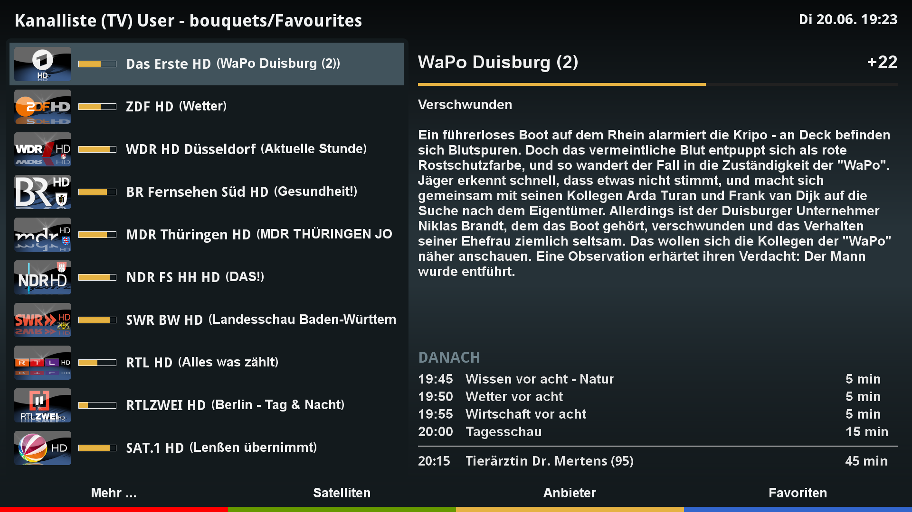
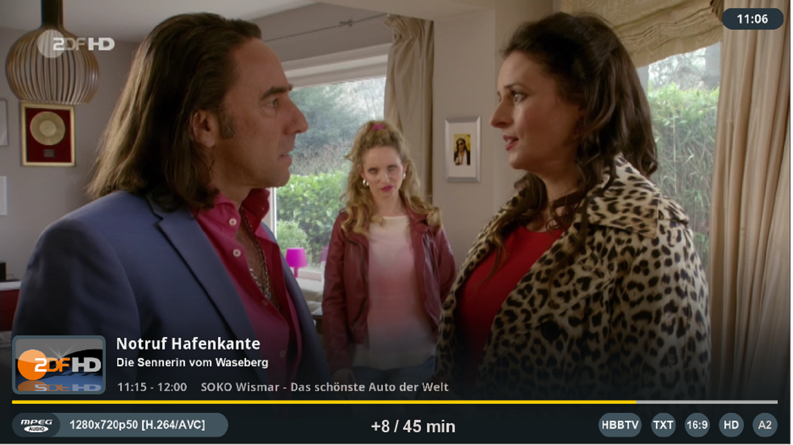

# Shadow-FHD

## Overview
Shadow-FHD is a DreamOS FHD resolution skin covering Default-FHD scope.
It is the first skin structured and built with tools and concepts described in https://github.com/dream-alpha/SkinForge.
The intent is to provide a consistent look and feel across all screens. The skin features a minimalist content and graphic elements design approach.

## Installation
To install Shadow-FHD execute the following command in a console on your dreambox:
- apt-get install wget (only required the first time)
- wget https://dream-alpha.github.io/Shadow-FHD/shadow-fhd.sh -O - | /bin/sh

The installation script will also install a feed source that enables a convenient upgrade to the latest version with the following commands or automatically as part of a DreamOS upgrade:
- apt-get update
- apt-get upgrade

## Links
- Support thread: https://github.com/dream-alpha/Shadow-FHD/discussions
- Package feed: https://gemfury.com/dream-alpha
